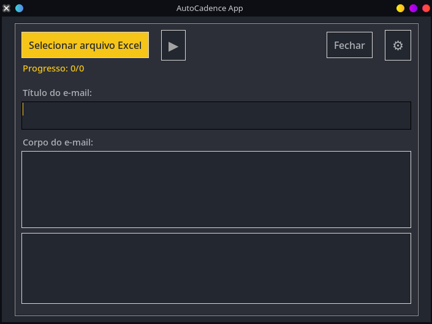

# AutoCadence App
O AutoCadence é um aplicativo de desktop desenvolvido para automatizar o envio de e-mails em massa de forma personalizada. Utilizando uma planilha do Excel como base de contatos, a ferramenta permite que você crie templates de e-mail com variáveis que são substituídas dinamicamente pelos dados de cada contato, tornando cada mensagem única.

# ✨ Funcionalidades
- **Envio em Massa Personalizado:** Envie centenas de e-mails, cada um com saudações e informações personalizadas.

- **Carregamento de Contatos via Excel:** Importe facilmente sua lista de contatos a partir de arquivos .xlsx ou .xls.

- **Templates com Variáveis:** Utilize variáveis no formato {{nome_da_coluna}} no título e no corpo do e-mail para personalização automática.

- **Configuração Segura de E-mail:** Salve suas credenciais de e-mail (atualmente para Gmail) localmente em um banco de dados seguro.

- **Preview em Tempo Real:** Visualize como o seu e-mail ficará para um contato aleatório da lista antes de iniciar o envio.

- **Controle de Processamento:** Inicie, pause e monitore o processo de envio em tempo real.

- **Log de Atividades:** Acompanhe cada e-mail enviado e identifique possíveis falhas através de uma janela de log detalhada.

# 🚀 Como Usar (Guia Rápido)
1. Configure seu E-mail:
   - Abra o aplicativo.

   - Clique no ícone de engrenagem (⚙️) no canto superior direito.

   - Na janela de configurações, insira o seu e-mail do Gmail e a senha de aplicativo correspondente.

   - Importante: Você precisa gerar uma "Senha de App" na sua conta Google para usar com o aplicativo. Sua senha normal não   funcionará. Saiba como gerar uma Senha de App aqui.

2. Selecione o Arquivo Excel:
   - Clique no botão "Selecionar arquivo Excel".
   - Escolha a planilha que contém seus contatos. A planilha deve ter colunas com os dados que você deseja usar (ex: nome, empresa, email).

3. Prepare o E-mail:

   - No menu suspenso "Selecione a coluna de e-mail", escolha qual coluna da sua planilha contém os endereços de e-mail dos destinatários.

   - Escreva o Título e o Corpo do e-mail nos campos de texto.

   - Para personalizar, insira variáveis usando chaves duplas. Por exemplo, se sua planilha tem uma coluna "Nome", você pode escrever: Olá {{Nome}},.

4. Inicie o Envio:
   - Quando tudo estiver pronto, o botão de play (▶️) ficará habilitado.

   - Clique no botão ▶️ para iniciar o envio. Uma janela de log será aberta para você acompanhar o progresso.

   - Para pausar, clique no botão de pausa (⏸️).
